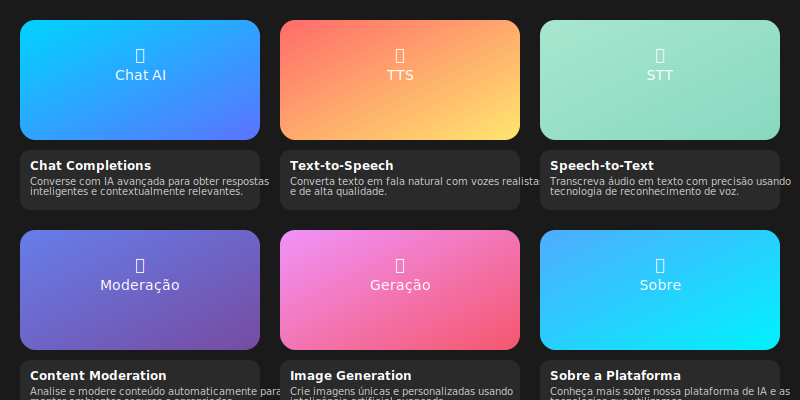

# 🤖 FrontAI - Plataforma de Inteligência Artificial

<div align="center">
  
  
  <p><em>Uma plataforma completa de IA com múltiplas funcionalidades integradas</em></p>
  
  [](https://python.org)
  [](https://fastapi.tiangolo.com)
  [](LICENSE)
  [](https://github.com/mmancilha)
</div>

---

## 📋 Sobre o Projeto

O **FrontAI** é uma plataforma web moderna e intuitiva que integra diversas funcionalidades de Inteligência Artificial em uma única interface. Desenvolvido como projeto de refinamento da pós-graduação em **IT-Valley**, esta aplicação demonstra a implementação prática de tecnologias de IA em um ambiente web responsivo e elegante.

### 🎯 Objetivo

Criar uma solução unificada que permita aos usuários acessar diferentes serviços de IA através de uma interface web moderna, proporcionando uma experiência fluida e profissional para interação com tecnologias de inteligência artificial.

---

## ✨ Funcionalidades Principais

### 💬 **Chat Completions**
- Interface de conversação avançada com IA
- Respostas contextuais e inteligentes
- Suporte a múltiplos modelos de linguagem
- Histórico de conversas

### 🔊 **Text-to-Speech (TTS)**
- Conversão de texto em fala natural
- Vozes realistas e de alta qualidade
- Múltiplas opções de idiomas e sotaques
- Controle de velocidade e tom

### 🎤 **Speech-to-Text (STT)**
- Transcrição precisa de áudio em texto
- Tecnologia avançada de reconhecimento de voz
- Suporte a diferentes formatos de áudio
- Processamento em tempo real

### 🛡️ **Content Moderation**
- Análise automática de conteúdo
- Detecção de conteúdo inadequado
- Filtros personalizáveis
- Relatórios detalhados de moderação

### 🎨 **Image Generation**
- Geração de imagens com IA
- Prompts personalizados
- Múltiplos estilos artísticos
- Alta resolução e qualidade

### 👤 **Sobre a Plataforma**
- Informações detalhadas do projeto
- Documentação técnica
- Links para repositórios
- Informações do desenvolvedor

---

## 🛠️ Tecnologias Utilizadas

- **Backend**: Python 3.12+ com FastAPI
- **Frontend**: HTML5, CSS3, JavaScript (ES6+)
- **UI/UX**: Bootstrap 5, Glassmorphism Design
- **Fontes**: Google Fonts (Inter, JetBrains Mono)
- **Ícones**: Bootstrap Icons
- **Animações**: CSS Animations, Fade-in Effects

---

## 📋 Requisitos de Instalação

### Pré-requisitos
- Python 3.12 ou superior
- pip (gerenciador de pacotes Python)
- Git

### Dependências Python
```
annotated-types==0.7.0
anyio==4.6.2.post1
click==8.1.7
colorama==0.4.6
fastapi==0.115.4
h11==0.14.0
idna==3.10
Jinja2==3.1.4
MarkupSafe==3.0.2
pydantic==2.9.2
pydantic_core==2.23.4
sniffio==1.3.1
starlette==0.41.2
typing_extensions==4.12.2
uvicorn==0.32.0
```

---

## 🚀 Instruções de Instalação e Uso

### 1. Clone o Repositório
```bash
git clone https://github.com/mmancilha/ai-frontend.git
cd ai-frontend
```

### 2. Crie um Ambiente Virtual
```bash
python -m venv venv
```

### 3. Ative o Ambiente Virtual
**Windows:**
```bash
venv\Scripts\activate
```

**Linux/macOS:**
```bash
source venv/bin/activate
```

### 4. Instale as Dependências
```bash
pip install -r requirements.txt
```

### 5. Execute a Aplicação
```bash
python start_dev.py
```

### 6. Acesse a Aplicação
Abra seu navegador e acesse: `http://localhost:8000`

---

## 📁 Estrutura do Projeto

```
FrontAI/
├── assets/                     # Recursos visuais
│   ├── frontai-interface.svg   # Interface principal
│   └── frontai-interface.png   # Imagem de backup
├── controllers/                # Controladores da aplicação
│   └── homeController.py       # Controlador principal
├── public/                     # Arquivos públicos
│   ├── assets/                 # CSS, JS, imagens
│   ├── templates/              # Templates HTML
│   └── view/                   # Páginas da aplicação
│       ├── home.html           # Página inicial
│       ├── chat2.html          # Interface de chat
│       ├── sobre.html          # Página sobre
│       ├── tts.html            # Text-to-Speech
│       ├── stt.html            # Speech-to-Text
│       ├── imagegeneration.html # Geração de imagens
│       └── moderation.html     # Moderação de conteúdo
├── services/                   # Serviços da aplicação
├── main.py                     # Aplicação principal
├── start_dev.py               # Script de desenvolvimento
├── hot_reload.py              # Hot reload para desenvolvimento
├── requirements.txt           # Dependências Python
└── README.md                  # Este arquivo
```

---

## 🎨 Design e Interface

### Características Visuais
- **Tema Escuro**: Interface moderna com tema dark
- **Gradientes**: Efeitos visuais sofisticados
- **Glassmorphism**: Efeitos de vidro translúcido
- **Responsivo**: Adaptável a diferentes dispositivos
- **Animações**: Transições suaves e elegantes

### Paleta de Cores
- **Chat**: Azul (#00D4FF → #5B73FF)
- **TTS**: Laranja/Amarelo (#FF6B6B → #FFE66D)
- **STT**: Verde (#A8E6CF → #88D8C0)
- **Moderação**: Roxo (#667EEA → #764BA2)
- **Geração**: Rosa (#F093FB → #F5576C)
- **Sobre**: Ciano (#4FACFE → #00F2FE)

---

## 🤝 Como Contribuir

### 1. Fork o Projeto
Clique no botão "Fork" no GitHub para criar sua cópia do repositório.

### 2. Crie uma Branch
```bash
git checkout -b feature/nova-funcionalidade
```

### 3. Faça suas Alterações
Implemente suas melhorias ou correções.

### 4. Commit suas Mudanças
```bash
git commit -m "feat: adiciona nova funcionalidade"
```

### 5. Push para a Branch
```bash
git push origin feature/nova-funcionalidade
```

### 6. Abra um Pull Request
Crie um Pull Request detalhando suas alterações.

---

## 📝 Convenções de Commit

Este projeto segue as [Conventional Commits](https://www.conventionalcommits.org/):

- `feat:` Nova funcionalidade
- `fix:` Correção de bug
- `docs:` Documentação
- `style:` Formatação
- `refactor:` Refatoração
- `test:` Testes
- `chore:` Manutenção

---

## 👨‍💻 Desenvolvedor

<div align="center">
  
  
  **Marcelo Mancilha**
  
  [](https://github.com/mmancilha)
  [](https://github.com/mmancilha/it-valley-school)
</div>

### 🎓 Contexto Acadêmico
Este projeto foi desenvolvido como parte do programa de pós-graduação da **IT-Valley**, demonstrando a aplicação prática de conceitos avançados de desenvolvimento web e integração com tecnologias de Inteligência Artificial.

---

## 📄 Licença

Este projeto está sob a licença MIT. Veja o arquivo [LICENSE](LICENSE) para mais detalhes.

---

## 🔗 Links Úteis

- [Repositório Principal](https://github.com/mmancilha/ai-frontend)
- [IT-Valley School](https://github.com/mmancilha/it-valley-school)
- [Documentação FastAPI](https://fastapi.tiangolo.com)
- [Bootstrap 5](https://getbootstrap.com)

---

<div align="center">
  <p>Desenvolvido com ❤️ por <a href="https://github.com/mmancilha">Marcelo Mancilha</a></p>
  <p><em>Projeto de Pós-Graduação IT-Valley - 2024</em></p>
</div>